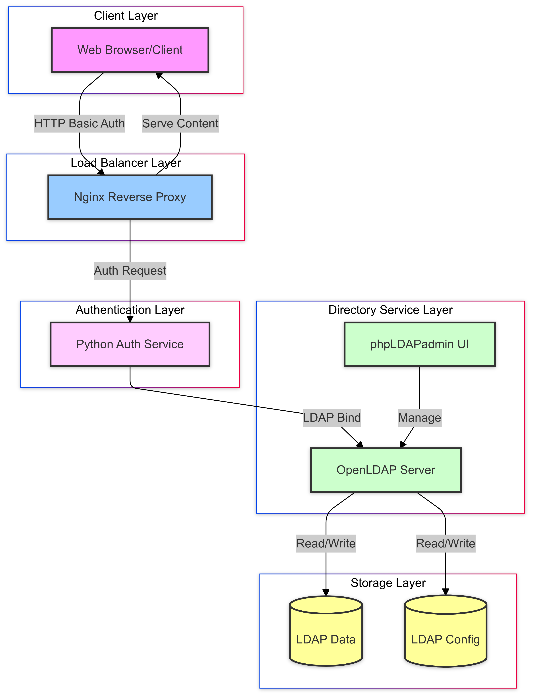
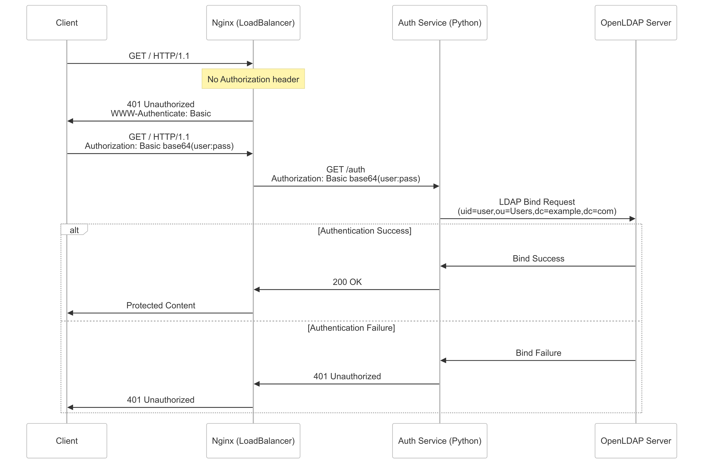

# LDAP Authentication with OpenResty

This project demonstrates LDAP authentication using OpenResty as a reverse proxy with a custom Lua-based LDAP authentication module.

## Components

- OpenLDAP server (LDAP directory service)
- phpLDAPadmin (Web UI for LDAP management)
- OpenResty (Nginx with Lua support for authentication)

## Architecture Diagram



## Sequence Diagram



## Default Credentials

### LDAP Admin
- Login DN: `cn=admin,dc=example,dc=com`
- Password: `admin123`

### Test User
- Username: `testuser`
- Password: `testpass`

## Setup & Testing

Add the following entry to your hosts file (`/etc/hosts`):

```
127.0.0.1 internal.example.com
```

run docker compose up

```
docker compose up
```

# Test LDAP connection

```
docker exec openldap ldapsearch -x -H ldap://localhost:389 -D "cn=admin,dc=example,dc=com" -w admin123 -b "dc=example,dc=com"
```

# Test without credentials (should get 401)

```bash
curl -i http://internal.example.com
```

# Test with correct credentials (should get 200)

```bash
curl -i --user testuser:testpass http://internal.example.com
```

# Test with wrong credentials (should get 401)

```bash
curl -i --user wronguser:wrongpass http://internal.example.com
```
