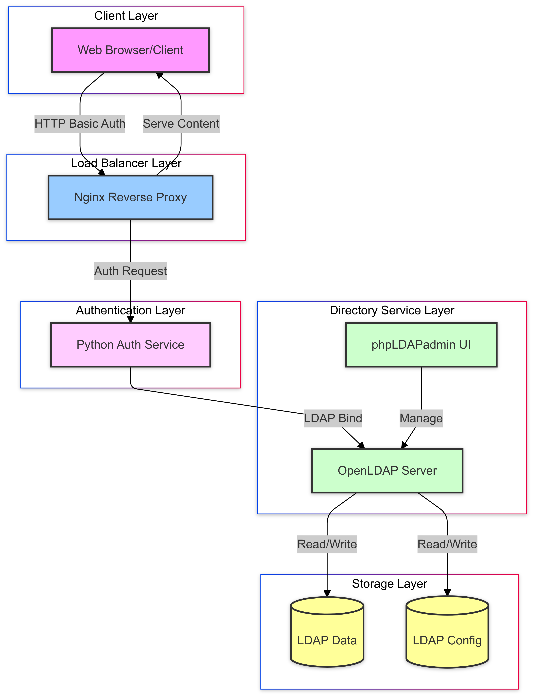

# LDAP Authentication with Express.js and Nginx

This project demonstrates LDAP authentication using Nginx as a reverse proxy with a Python-based LDAP authentication service, protecting both static content and an Express.js API.

## Components

- OpenLDAP server (LDAP directory service)
- phpLDAPadmin (Web UI for LDAP management)
- Python Auth Service (LDAP authentication)
- Express.js API (Protected service)
- Nginx (Reverse proxy)

## Architecture Diagram



## Sequence Diagram


## Default Credentials

### LDAP Admin
- Login DN: `cn=admin,dc=example,dc=com`
- Password: `admin123`

### Test User
- Username: `testuser`
- Password: `testpass`

## Setup & Testing

### Local Testing

Add the following entry to your hosts file (`/etc/hosts`):
```
127.0.0.1 internal.example.com
```

Start the services:
```bash
docker compose up
```

### Test LDAP Connection
```bash
docker exec openldap ldapsearch -x -H ldap://localhost:389 -D "cn=admin,dc=example,dc=com" -w admin123 -b "dc=example,dc=com"
```

### Test Static Content

```bash
# Test without credentials (should get 401)
curl -i http://internal.example.com

# Test with correct credentials (should get 200)
curl -i --user testuser:testpass http://internal.example.com

# Test with wrong credentials (should get 401)
curl -i --user wronguser:wrongpass http://internal.example.com
```

### Test Express.js API

```bash
# Test the API endpoint with correct credentials
curl -i --user testuser:testpass http://internal.example.com/api/

# Test with wrong credentials
curl -i --user wronguser:wrongpass http://internal.example.com/api/
```

### Android Emulator Testing

When testing from Android emulator, use `10.0.2.2` instead of `localhost`:

1. Add to Android hosts file or use the IP directly:
```
10.0.2.2    internal.example.com
```

2. Test using curl from emulator:
```bash
curl -i --user testuser:testpass http://10.0.2.2/api/
```

3. Or in Android app code:
```javascript
fetch('http://10.0.2.2/api/', {
  headers: {
    'Authorization': 'Basic ' + btoa('testuser:testpass')
  }
})
```

## Services

- OpenLDAP: Directory service (port 389)
- phpLDAPadmin: LDAP management UI (port 8080)
- Auth Service: Python-based LDAP authentication
- Express.js: Protected API service
- Nginx: Reverse proxy and authentication handler (port 80)

## Notes

- CORS is enabled for cross-origin requests
- Basic authentication is used for simplicity
- Android emulator uses `10.0.2.2` to access host's localhost
- Network security config might need updating in Android app for cleartext traffic